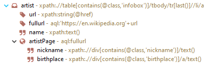
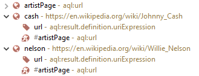

# Webscrapper to JSON or EMF model

## Installation

**Standard mode**

Install and open [Eclipse-Installer](https://www.eclipse.org/downloads/download.php?file=/oomph/products/eclipse-inst-win64.exe), then just go on settings and enable `Web-Links`.

Afterwards, click **twice** on 

**Advanced mode**

Install [Eclipse-Installer](https://www.eclipse.org/downloads/download.php?file=/oomph/products/eclipse-inst-win64.exe). 

`Advanced mode` > `Add user products` > and choose [Setup file](https://raw.githubusercontent.com/pdulvp/eclipse-retriever/master/target/product.setup)

**In an existing Eclipse platform**

`Help` > `Install new Software` > and choose [Update site](https://pdulvp.github.io/eclipse-repository/eclipse-retriever)

## How to use it

**Create a new project**

Once created, it will appear in the `Project Explorer`. Just double click on the `.retriever` file to open the editor.

**Describe how to fetch the site**

 URL

 Element

 Attribute

In this sample, we will retrieve from a Wikipedia page, its `title`, the `lastModified` date and `artists` of the music supergroup described in the page.

**Run it**

- Select the top  `highwaymen` element

- On the main toolbar, just click on  `Fetch`

Result appears on the bottom.

By doubleclicking on the top  `highwaymen`, the JSON editor opens.

**Fetch sub pages**

From an element, we can fetch sub pages. 

Here, retrieved `links` are relative, by using  `Set Variable`, we can compute a `fullURL`.

Then we add a child  `URL element` towards this `fullURL` and retrieve some attributes from the sub page.

By  `Fetch` again, the result becomes:

or as JSON: 

**Models manipulation**

 `LoadResource` allows to create/load a resource from workspace.

 `CreateEObject` allows to create the given EObject.

 `CreateEAttribute` allows to set the given attribute on an EObject.

 `CreateEReference` allows to set the given reference on an EObject.

For instance, load the resource `schema.ecore`, retrieve the `root` element. If the resource is empty, create a root element called `Artists`

Some expressions used above

-  `resource:<variable>.root` expression allows to retrieve the root of a resource.

-  `variable:<variable>.isNull` returns whether the variable is `null` or not.

With the following example, we will create an EClass into `schema.ecore` for each album on the page.

If fetched again, new albums will be added to the file.

**Reuse retrievers**

 `ReferencedRetriever` allows to reuse a retriever. According to variables, it may behave differently.

For instance, if we update our top  `artistPage` from 

to 

We can now fetch two different pages. The ecore will contain both artist albums.

**Additional operators**

 `If` allowing to process only if the `conditionExpression` is true

 `TransformationService` allowing to define a service from a `java` class and method, to text-processing fetched results using `java`.

 `TransformationRetriever` allowing to retrieve an element, but passed directly to a `TransformationService` `[TO IMPROVE / TO DELETE / TBD]`

